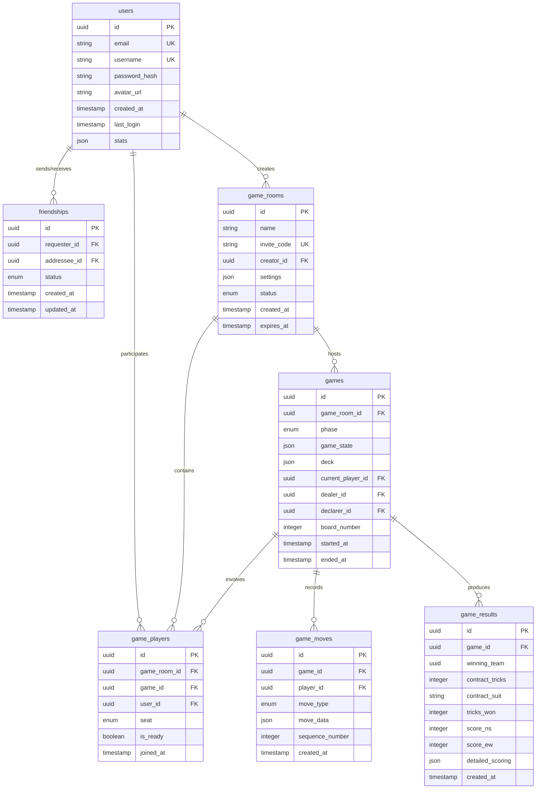
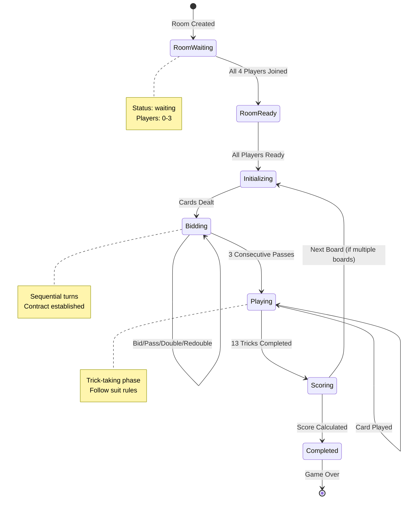
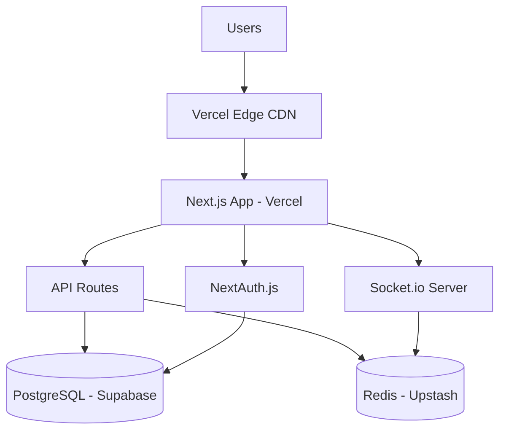

# BridgeOnline - Comprehensive Design Document

## Executive Summary

BridgeOnline is a web-based, real-time multiplayer Bridge card game built on **Next.js 14/15** using the **App Router**. The application enables registered users to play Contract Bridge online with friends through private game rooms, supporting authentic ACBL-compliant gameplay with customizable bidding systems and game configurations.

---

## 1. Project Overview

### 1.1 Core Objectives
- Provide an authentic Contract Bridge experience following **ACBL (American Contract Bridge League)** rules
- Enable real-time multiplayer gameplay for 4 players
- Support social features including friend requests and private game rooms
- Offer flexible bidding systems (Standard American, SAYC)
- Deliver a responsive, modern UI/UX experience

### 1.2 Technology Stack

#### Frontend
- **Framework**: Next.js 14/15 (App Router, Server Components, Server Actions)
- **Language**: TypeScript
- **Styling**: Tailwind CSS with custom design system
- **State Management**: Zustand or React Context + hooks
- **Real-time**: Socket.io Client
- **UI Components**: shadcn/ui or Radix UI primitives
- **Forms**: React Hook Form + Zod validation

#### Backend
- **Runtime**: Node.js 18+
- **API**: Next.js API Routes (App Router format)
- **Real-time**: Socket.io Server
- **Authentication**: NextAuth.js v5 (Auth.js) or Clerk
- **Database**: PostgreSQL with Prisma ORM
- **Caching**: Redis (for session management and game state)
- **File Storage**: Vercel Blob or AWS S3 (for avatars)

#### Infrastructure
- **Hosting**: Vercel (Frontend + Serverless Functions)
- **Database Hosting**: Supabase, Railway, or Neon
- **Redis Hosting**: Upstash Redis
- **CDN**: Vercel Edge Network

---

## 2. Database Schema Design

### 2.1 Entity Relationship Overview



### 2.2 Detailed Schema Definitions

#### Users Table
```sql
CREATE TABLE users (
    id UUID PRIMARY KEY DEFAULT gen_random_uuid(),
    email VARCHAR(255) UNIQUE NOT NULL,
    username VARCHAR(50) UNIQUE NOT NULL,
    password_hash VARCHAR(255) NOT NULL, -- If using NextAuth credentials
    avatar_url TEXT,
    created_at TIMESTAMP DEFAULT NOW(),
    last_login TIMESTAMP,
    stats JSONB DEFAULT '{"games_played": 0, "games_won": 0, "total_score": 0}'::jsonb,
    
    CONSTRAINT email_format CHECK (email ~* '^[A-Za-z0-9._%+-]+@[A-Za-z0-9.-]+\.[A-Z|a-z]{2,}$')
);

CREATE INDEX idx_users_email ON users(email);
CREATE INDEX idx_users_username ON users(username);
```

#### Friendships Table
```sql
CREATE TYPE friendship_status AS ENUM ('pending', 'accepted', 'rejected', 'blocked');

CREATE TABLE friendships (
    id UUID PRIMARY KEY DEFAULT gen_random_uuid(),
    requester_id UUID NOT NULL REFERENCES users(id) ON DELETE CASCADE,
    addressee_id UUID NOT NULL REFERENCES users(id) ON DELETE CASCADE,
    status friendship_status DEFAULT 'pending',
    created_at TIMESTAMP DEFAULT NOW(),
    updated_at TIMESTAMP DEFAULT NOW(),
    
    CONSTRAINT no_self_friendship CHECK (requester_id != addressee_id),
    CONSTRAINT unique_friendship UNIQUE (requester_id, addressee_id)
);

CREATE INDEX idx_friendships_requester ON friendships(requester_id);
CREATE INDEX idx_friendships_addressee ON friendships(addressee_id);
CREATE INDEX idx_friendships_status ON friendships(status);
```

#### Game Rooms Table
```sql
CREATE TYPE room_status AS ENUM ('waiting', 'ready', 'in_progress', 'completed', 'abandoned');

CREATE TABLE game_rooms (
    id UUID PRIMARY KEY DEFAULT gen_random_uuid(),
    name VARCHAR(100) NOT NULL,
    invite_code VARCHAR(10) UNIQUE NOT NULL,
    creator_id UUID NOT NULL REFERENCES users(id) ON DELETE CASCADE,
    settings JSONB DEFAULT '{
        "bidding_system": "SAYC",
        "num_boards": 1,
        "timer_enabled": true,
        "timer_duration": 90,
        "vulnerability_rotation": "standard"
    }'::jsonb,
    status room_status DEFAULT 'waiting',
    created_at TIMESTAMP DEFAULT NOW(),
    expires_at TIMESTAMP DEFAULT NOW() + INTERVAL '24 hours',
    
    CONSTRAINT invite_code_format CHECK (invite_code ~ '^[A-Z0-9]{6,10}$')
);

CREATE INDEX idx_game_rooms_invite_code ON game_rooms(invite_code);
CREATE INDEX idx_game_rooms_creator ON game_rooms(creator_id);
CREATE INDEX idx_game_rooms_status ON game_rooms(status);
```

#### Game Players Table
```sql
CREATE TYPE seat_position AS ENUM ('north', 'south', 'east', 'west');

CREATE TABLE game_players (
    id UUID PRIMARY KEY DEFAULT gen_random_uuid(),
    game_room_id UUID NOT NULL REFERENCES game_rooms(id) ON DELETE CASCADE,
    game_id UUID REFERENCES games(id) ON DELETE CASCADE,
    user_id UUID NOT NULL REFERENCES users(id) ON DELETE CASCADE,
    seat seat_position NOT NULL,
    is_ready BOOLEAN DEFAULT FALSE,
    joined_at TIMESTAMP DEFAULT NOW(),
    
    CONSTRAINT unique_seat_per_room UNIQUE (game_room_id, seat),
    CONSTRAINT unique_user_per_room UNIQUE (game_room_id, user_id)
);

CREATE INDEX idx_game_players_room ON game_players(game_room_id);
CREATE INDEX idx_game_players_game ON game_players(game_id);
CREATE INDEX idx_game_players_user ON game_players(user_id);
```

#### Games Table
```sql
CREATE TYPE game_phase AS ENUM ('initializing', 'bidding', 'playing', 'scoring', 'completed');

CREATE TABLE games (
    id UUID PRIMARY KEY DEFAULT gen_random_uuid(),
    game_room_id UUID NOT NULL REFERENCES game_rooms(id) ON DELETE CASCADE,
    phase game_phase DEFAULT 'initializing',
    game_state JSONB DEFAULT '{
        "hands": {},
        "current_bid": null,
        "bid_history": [],
        "tricks": [],
        "current_trick": [],
        "trump_suit": null,
        "contract": null
    }'::jsonb,
    deck JSONB, -- Encrypted/hashed card distribution
    current_player_id UUID REFERENCES users(id),
    dealer_id UUID NOT NULL REFERENCES users(id),
    declarer_id UUID REFERENCES users(id),
    board_number INTEGER DEFAULT 1,
    started_at TIMESTAMP DEFAULT NOW(),
    ended_at TIMESTAMP,
    
    CONSTRAINT valid_board_number CHECK (board_number > 0)
);

CREATE INDEX idx_games_room ON games(game_room_id);
CREATE INDEX idx_games_phase ON games(phase);
CREATE INDEX idx_games_current_player ON games(current_player_id);
```

#### Game Moves Table
```sql
CREATE TYPE move_type AS ENUM ('bid', 'pass', 'double', 'redouble', 'play_card');

CREATE TABLE game_moves (
    id UUID PRIMARY KEY DEFAULT gen_random_uuid(),
    game_id UUID NOT NULL REFERENCES games(id) ON DELETE CASCADE,
    player_id UUID NOT NULL REFERENCES users(id),
    move_type move_type NOT NULL,
    move_data JSONB NOT NULL, -- e.g., {"bid": "1H"} or {"card": "AS"}
    sequence_number INTEGER NOT NULL,
    created_at TIMESTAMP DEFAULT NOW(),
    
    CONSTRAINT unique_sequence UNIQUE (game_id, sequence_number)
);

CREATE INDEX idx_game_moves_game ON game_moves(game_id);
CREATE INDEX idx_game_moves_sequence ON game_moves(game_id, sequence_number);
```

#### Game Results Table
```sql
CREATE TABLE game_results (
    id UUID PRIMARY KEY DEFAULT gen_random_uuid(),
    game_id UUID UNIQUE NOT NULL REFERENCES games(id) ON DELETE CASCADE,
    winning_team VARCHAR(2) CHECK (winning_team IN ('NS', 'EW')),
    contract_tricks INTEGER,
    contract_suit VARCHAR(2), -- 'C', 'D', 'H', 'S', 'NT'
    tricks_won INTEGER,
    score_ns INTEGER DEFAULT 0,
    score_ew INTEGER DEFAULT 0,
    detailed_scoring JSONB, -- Breakdown of points
    created_at TIMESTAMP DEFAULT NOW()
);

CREATE INDEX idx_game_results_game ON game_results(game_id);
```

---

## 3. Game Engine State Machine

### 3.1 State Diagram



### 3.2 State Definitions

#### State: Room Waiting
- **Entry Conditions**: Room created by user
- **Valid Actions**:
  - Join room (via invite code)
  - Select seat (North/South/East/West)
  - Mark as ready
  - Leave room
- **Exit Conditions**: All 4 seats filled → Room Ready

#### State: Room Ready
- **Entry Conditions**: 4 players joined
- **Valid Actions**:
  - Mark ready/unready
  - Leave room (triggers back to Waiting)
  - Configure settings (creator only)
- **Exit Conditions**: All players ready → Initializing

#### State: Initializing
- **Entry Conditions**: All players ready
- **Server Actions**:
  1. Generate shuffled 52-card deck
  2. Distribute 13 cards to each player
  3. Determine dealer (rotation based on board number)
  4. Set vulnerability based on board number
  5. Initialize game state
- **Exit Conditions**: Automatically → Bidding

#### State: Bidding
- **Entry Conditions**: Cards dealt
- **Turn Order**: Clockwise from dealer
- **Valid Actions**:
  - Make bid (level 1-7, suit C/D/H/S/NT)
  - Pass
  - Double (if opponent bid)
  - Redouble (if partner's bid was doubled)
- **Validation Rules**:
  - Bid must be higher than previous bid
  - Suit hierarchy: ♣ < ♦ < ♥ < ♠ < NT
  - Double only valid on opponent's bid
  - Redouble only valid on own team's doubled bid
- **Exit Conditions**: 3 consecutive passes → Playing
- **Contract Determination**:
  - Last bid becomes contract
  - Player who first bid contract suit becomes declarer
  - Partner becomes dummy

#### State: Playing
- **Entry Conditions**: Contract established
- **Turn Order**: 
  1. Player to left of declarer leads first trick
  2. Winner of trick leads next trick
- **Valid Actions**:
  - Play card from hand
- **Validation Rules**:
  - Must follow suit if possible
  - If cannot follow suit, can play any card
- **Trick Resolution**:
  - Highest trump wins (if trump played)
  - Otherwise, highest card of led suit wins
- **Dummy Behavior**:
  - Hand revealed after opening lead
  - Declarer plays for dummy
- **Exit Conditions**: All 13 tricks played → Scoring

#### State: Scoring
- **Entry Conditions**: 13 tricks completed
- **Server Actions**:
  1. Count tricks won by declaring team
  2. Calculate contract score
  3. Apply vulnerability bonus/penalty
  4. Check for overtricks/undertricks
  5. Apply game/slam bonuses
  6. Record results
- **Exit Conditions**: 
  - If more boards remain → Initializing
  - Otherwise → Completed

#### State: Completed
- **Entry Conditions**: All boards played
- **Server Actions**:
  - Finalize game statistics
  - Update user stats
  - Archive game state
- **Valid Actions**:
  - View final scoreboard
  - Exit to lobby
  - Create new game

### 3.3 Scoring Algorithm (ACBL Duplicate Bridge)

```typescript
interface Contract {
  level: number; // 1-7
  suit: 'C' | 'D' | 'H' | 'S' | 'NT';
  doubled: boolean;
  redoubled: boolean;
}

interface Vulnerability {
  NS: boolean;
  EW: boolean;
}

function calculateScore(
  contract: Contract,
  tricksWon: number,
  declarer: 'NS' | 'EW',
  vulnerability: Vulnerability
): { scoreNS: number; scoreEW: number } {
  const requiredTricks = 6 + contract.level;
  const isVulnerable = vulnerability[declarer];
  const overtricks = tricksWon - requiredTricks;
  const undertricks = requiredTricks - tricksWon;
  
  let score = 0;
  
  if (overtricks >= 0) {
    // Contract made
    // 1. Trick score
    const basePoints = contract.suit === 'NT' 
      ? 40 + (contract.level - 1) * 30
      : (contract.suit === 'C' || contract.suit === 'D') 
        ? contract.level * 20 
        : contract.level * 30;
    
    score += contract.doubled ? basePoints * 2 : 
             contract.redoubled ? basePoints * 4 : 
             basePoints;
    
    // 2. Overtrick bonus
    if (overtricks > 0) {
      if (contract.doubled) {
        score += overtricks * (isVulnerable ? 200 : 100);
      } else if (contract.redoubled) {
        score += overtricks * (isVulnerable ? 400 : 200);
      } else {
        const overtrickValue = (contract.suit === 'C' || contract.suit === 'D') ? 20 : 30;
        score += overtricks * overtrickValue;
      }
    }
    
    // 3. Game bonus
    if (score >= 100) {
      score += isVulnerable ? 500 : 300;
    } else {
      score += 50; // Partscore bonus
    }
    
    // 4. Slam bonus
    if (contract.level === 6) {
      score += isVulnerable ? 750 : 500; // Small slam
    } else if (contract.level === 7) {
      score += isVulnerable ? 1500 : 1000; // Grand slam
    }
    
    // 5. Double/Redouble bonus
    if (contract.doubled) score += 50;
    if (contract.redoubled) score += 100;
    
  } else {
    // Contract failed (undertricks)
    if (contract.doubled) {
      undertricks.forEach((_, i) => {
        if (i === 0) score -= isVulnerable ? 200 : 100;
        else if (i <= 2) score -= isVulnerable ? 300 : 200;
        else score -= isVulnerable ? 300 : 300;
      });
      if (contract.redoubled) score *= 2;
    } else {
      score -= undertricks * (isVulnerable ? 100 : 50);
    }
  }
  
  return declarer === 'NS' 
    ? { scoreNS: score, scoreEW: 0 }
    : { scoreNS: 0, scoreEW: score };
}
```

---

## 4. API Routes & Endpoints

### 4.1 Authentication Routes

#### `POST /api/auth/register`
**Description**: Register a new user

**Request Body**:
```typescript
{
  email: string;
  username: string;
  password: string;
}
```

**Response**:
```typescript
{
  success: boolean;
  user?: {
    id: string;
    email: string;
    username: string;
  };
  error?: string;
}
```

#### `POST /api/auth/login`
**Description**: Authenticate user (if using NextAuth credentials)

**Request Body**:
```typescript
{
  email: string;
  password: string;
}
```

**Response**:
```typescript
{
  success: boolean;
  token?: string;
  user?: UserProfile;
  error?: string;
}
```

### 4.2 User & Social Routes

#### `GET /api/users/search?q={query}`
**Description**: Search for users by username

**Response**:
```typescript
{
  users: Array<{
    id: string;
    username: string;
    avatar_url: string;
  }>;
}
```

#### `POST /api/friends/request`
**Description**: Send friend request

**Request Body**:
```typescript
{
  addresseeId: string;
}
```

**Response**:
```typescript
{
  success: boolean;
  friendshipId?: string;
  error?: string;
}
```

#### `PATCH /api/friends/{friendshipId}`
**Description**: Accept/reject friend request

**Request Body**:
```typescript
{
  action: 'accept' | 'reject';
}
```

#### `GET /api/friends`
**Description**: Get user's friends and pending requests

**Response**:
```typescript
{
  friends: UserProfile[];
  pendingReceived: FriendRequest[];
  pendingSent: FriendRequest[];
}
```

### 4.3 Game Room Routes

#### `POST /api/rooms/create`
**Description**: Create a new game room

**Request Body**:
```typescript
{
  name: string;
  settings: {
    biddingSystem: 'SAYC' | 'StandardAmerican';
    numBoards: number;
    timerEnabled: boolean;
    timerDuration: number; // seconds
  };
}
```

**Response**:
```typescript
{
  roomId: string;
  inviteCode: string;
}
```

#### `POST /api/rooms/join`
**Description**: Join a room via invite code

**Request Body**:
```typescript
{
  inviteCode: string;
}
```

**Response**:
```typescript
{
  success: boolean;
  room?: GameRoom;
  error?: string;
}
```

#### `GET /api/rooms/{roomId}`
**Description**: Get room details

**Response**:
```typescript
{
  id: string;
  name: string;
  inviteCode: string;
  settings: RoomSettings;
  players: Array<{
    userId: string;
    username: string;
    seat: 'north' | 'south' | 'east' | 'west';
    isReady: boolean;
  }>;
  status: 'waiting' | 'ready' | 'in_progress' | 'completed';
}
```

#### `PATCH /api/rooms/{roomId}/seat`
**Description**: Select or change seat

**Request Body**:
```typescript
{
  seat: 'north' | 'south' | 'east' | 'west';
}
```

#### `PATCH /api/rooms/{roomId}/ready`
**Description**: Toggle ready status

**Request Body**:
```typescript
{
  isReady: boolean;
}
```

### 4.4 Game Action Routes

#### `POST /api/games/{gameId}/bid`
**Description**: Make a bid during auction

**Request Body**:
```typescript
{
  action: 'bid' | 'pass' | 'double' | 'redouble';
  bid?: {
    level: 1-7;
    suit: 'C' | 'D' | 'H' | 'S' | 'NT';
  };
}
```

**Response**:
```typescript
{
  success: boolean;
  gameState?: GameState;
  error?: string;
}
```

#### `POST /api/games/{gameId}/play`
**Description**: Play a card

**Request Body**:
```typescript
{
  card: string; // e.g., "AS" (Ace of Spades)
}
```

**Response**:
```typescript
{
  success: boolean;
  gameState?: GameState;
  error?: string;
}
```

#### `GET /api/games/{gameId}/state`
**Description**: Get current game state

**Response**:
```typescript
{
  gameId: string;
  phase: GamePhase;
  currentPlayer: string;
  hand: Card[]; // Only player's own cards
  bidHistory: Bid[];
  currentTrick: Card[];
  tricksWon: { NS: number, EW: number };
  contract?: Contract;
  dummyHand?: Card[]; // Only visible after first card played
}
```

---

## 5. Real-Time WebSocket Events

### 5.1 Socket.io Event Schema

**Server → Client Events**

| Event Name | Payload | Description |
|------------|---------|-------------|
| `room:player_joined` | `{ userId, username, seat }` | Player joined room |
| `room:player_left` | `{ userId, seat }` | Player left room |
| `room:player_ready` | `{ userId, isReady }` | Player ready status changed |
| `room:settings_updated` | `{ settings }` | Room settings changed |
| `game:started` | `{ gameId, dealer, hands }` | Game initialized |
| `game:bid_made` | `{ playerId, bid, nextPlayer }` | Bid was made |
| `game:contract_established` | `{ contract, declarer, dummy }` | Auction ended |
| `game:card_played` | `{ playerId, card, trick }` | Card played |
| `game:trick_completed` | `{ winner, tricksWon }` | Trick completed |
| `game:dummy_revealed` | `{ dummyHand }` | Dummy's hand shown |
| `game:phase_changed` | `{ phase, gameState }` | Game phase transition |
| `game:completed` | `{ results, scores }` | Game ended |
| `timer:tick` | `{ timeRemaining }` | Timer countdown |
| `error` | `{ message, code }` | Error occurred |

**Client → Server Events**

| Event Name | Payload | Description |
|------------|---------|-------------|
| `room:join` | `{ inviteCode }` | Join room |
| `room:select_seat` | `{ seat }` | Choose seat |
| `room:toggle_ready` | `{ }` | Ready/unready |
| `game:make_bid` | `{ action, bid }` | Bid action |
| `game:play_card` | `{ card }` | Play card |
| `chat:message` | `{ message }` | Send chat message |

### 5.2 Socket Connection Flow

```typescript
// Client-side connection
import { io } from 'socket.io-client';

const socket = io(process.env.NEXT_PUBLIC_SOCKET_URL, {
  auth: {
    token: session.user.token
  }
});

// Join room
socket.emit('room:join', { inviteCode: 'ABC123' });

// Listen for events
socket.on('game:bid_made', (data) => {
  updateGameState(data);
});

// Make a bid
socket.emit('game:make_bid', {
  action: 'bid',
  bid: { level: 1, suit: 'H' }
});
```

---

## 6. UI/UX Component Breakdown

### 6.1 Component Hierarchy

```
App
├── AuthProvider
├── SocketProvider
└── Layout
    ├── Header
    │   ├── Logo
    │   ├── Navigation
    │   └── UserMenu
    └── Main
        ├── AuthPages
        │   ├── LoginPage
        │   ├── RegisterPage
        │   └── OnboardingPage (How to Play)
        ├── DashboardPage
        │   ├── UserProfileCard
        │   ├── FriendsList
        │   ├── CreateRoomButton
        │   └── JoinRoomModal
        ├── GameLobbyPage
        │   ├── RoomInfoPanel
        │   ├── SeatSelectionGrid
        │   ├── PlayerCards
        │   ├── SettingsPanel
        │   └── ReadyButton
        └── GameTablePage
            ├── GameHeader
            │   ├── GameInfo
            │   └── Timer
            ├── GameTable
            │   ├── CardTable (SVG layout)
            │   ├── PlayerHand (South)
            │   ├── OpponentHands (North/East/West)
            │   ├── CurrentTrick
            │   └── TrickCounter
            ├── BiddingPanel
            │   ├── BidHistory
            │   ├── BiddingControls
            │   └── ContractDisplay
            ├── PlayingPanel
            │   └── PlayableCards
            └── ScoringPanel
                ├── Scoreboard
                └── DetailedResults
```

### 6.2 Key Component Specifications

#### GameTable Component
**Purpose**: Visual representation of the Bridge table

**Layout**:
```
         [North Player]
              ↓
          [Current Trick]
              ↓
[West] ← [Card Table] → [East]
              ↑
         [Your Hand]
          (South)
```

**Features**:
- SVG-based circular table
- Card animations for dealing and playing
- Trick collection animations
- Dummy hand display (face-up after first card)

#### BiddingControls Component
**Purpose**: Interface for making bids

**UI Elements**:
- Grid of bid buttons (1C through 7NT)
- Pass button
- Double/Redouble buttons (conditional)
- Disabled state for invalid bids
- Visual hierarchy based on suit colors

**Example Layout**:
```
| 7NT | 7♠ | 7♥ | 7♦ | 7♣ |
| 6NT | 6♠ | 6♥ | 6♦ | 6♣ |
...
| 1NT | 1♠ | 1♥ | 1♦ | 1♣ |
|     | DBL | RDBL | PASS |
```

#### PlayerHand Component
**Purpose**: Display and interact with player's cards

**Features**:
- Fan layout of cards
- Hover expansion
- Click to play
- Visual feedback for valid/invalid plays
- Suit grouping and sorting

#### BidHistory Component
**Purpose**: Display auction sequence

**UI**:
```
West    North   East    South
Pass    1♥      Pass    2♥
Pass    4♥      Pass    Pass
Pass
```

### 6.3 Page Wireframes

#### Dashboard Wireframe
```
┌────────────────────────────────────────────────┐
│  BridgeOnline        Friends   Games   Profile │
├────────────────────────────────────────────────┤
│                                                 │
│  ┌─────────────┐  ┌──────────────────────────┐│
│  │             │  │  Friends (12)             ││
│  │   Avatar    │  │  ┌────────────────────┐  ││
│  │             │  │  │ User1    [Message] │  ││
│  │  Username   │  │  │ User2    [Message] │  ││
│  │             │  │  └────────────────────┘  ││
│  │  Stats:     │  │                          ││
│  │  Games: 42  │  │  Pending Requests (2)    ││
│  │  Wins: 28   │  │  ┌────────────────────┐  ││
│  └─────────────┘  │  │ User3  [✓] [✗]     │  ││
│                    │  └────────────────────┘  ││
│  ┌──────────────┐ │                          ││
│  │ CREATE ROOM  │ │  [Search Users...]       ││
│  └──────────────┘ └──────────────────────────┘│
│  ┌──────────────┐                             │
│  │  JOIN ROOM   │    Recent Games             │
│  └──────────────┘    ┌─────────────────────┐ │
│                      │ Game #42  2h ago    │ │
│                      │ Result: +420 (Won)  │ │
│                      └─────────────────────┘ │
└────────────────────────────────────────────────┘
```

#### Game Lobby Wireframe
```
┌────────────────────────────────────────────────┐
│  ← Back to Dashboard    Room: Friday Night Br. │
│  Invite Code: ABCD1234              [Copy]     │
├────────────────────────────────────────────────┤
│                                                 │
│            ┌─────────────────┐                 │
│            │     NORTH       │                 │
│            │  [Select Seat]  │                 │
│            └─────────────────┘                 │
│                                                 │
│  ┌─────────────┐             ┌─────────────┐  │
│  │    WEST     │             │    EAST     │  │
│  │ User2 ✓     │             │[Select Seat]│  │
│  └─────────────┘             └─────────────┘  │
│                                                 │
│            ┌─────────────────┐                 │
│            │     SOUTH       │                 │
│            │   You (Host)    │                 │
│            │    [Ready]      │                 │
│            └─────────────────┘                 │
│                                                 │
│  Settings:                                     │
│  ☑ Bidding System: SAYC                        │
│  ☑ Boards: 1                                   │
│  ☑ Timer: 90s                                  │
│                          [Start Game]          │
└────────────────────────────────────────────────┘
```

#### Game Table Wireframe
```
┌────────────────────────────────────────────────┐
│  Board #1  |  Dealer: South  |  Vuln: None     │
│  Contract: 4♥ by South       Time: 01:23  ⏱   │
├────────────────────────────────────────────────┤
│                   North                         │
│              [13 cards face-down]              │
│                                                 │
│  West    ┌─────────────────┐           East   │
│  [13]    │  Current Trick:  │           [13]  │
│          │   ♥7  ♥Q  ♥K  ?  │                 │
│          └─────────────────┘                   │
│                                                 │
│                   South (You)                   │
│     ♠AK5  ♥AQJ1098  ♦K32  ♣A4                  │
│              [Click card to play]              │
│                                                 │
│  Tricks: NS: 5  EW: 2                          │
├────────────────────────────────────────────────┤
│  Bid History:                                  │
│  S     W     N     E                           │
│  1♥    Pass  3♥    Pass                        │
│  4♥    Pass  Pass  Pass                        │
└────────────────────────────────────────────────┘
```

### 6.4 Responsive Design Strategy

**Breakpoints**:
- Mobile: < 640px (portrait phone)
- Tablet: 640px - 1024px
- Desktop: > 1024px

**Mobile Adaptations**:
- Vertical card table layout
- Simplified bid controls (modal overlay)
- Collapsible bid history
- Swipeable card hand
- Bottom sheet for settings

---

## 7. Security & Data Protection

### 7.1 Authentication Security
- Password hashing using bcrypt (cost factor: 12)
- JWT tokens with short expiration (15 minutes access, 7 days refresh)
- HTTP-only secure cookies
- Rate limiting on auth endpoints (5 attempts per 15 minutes)

### 7.2 Game Integrity
- **Server-side validation**: All game moves validated on server
- **Encrypted card distribution**: Player hands never exposed to other clients
- **Move sequence verification**: Prevent replay attacks or out-of-order moves
- **Timeout detection**: Auto-forfeit on prolonged inactivity

### 7.3 Data Privacy
- Only expose necessary user data (no emails in public APIs)
- Game results anonymized after 90 days
- Invite codes expire after 24 hours
- GDPR-compliant data export/deletion

---

## 8. Performance Optimization

### 8.1 Caching Strategy
- **Redis caching**:
  - Active game state (TTL: 4 hours)
  - User sessions (TTL: 7 days)
  - Room data (TTL: 24 hours)
- **Client-side caching**:
  - SWR for API data
  - IndexedDB for offline game history

### 8.2 Real-time Optimizations
- Socket event batching for multiple rapid updates
- Optimistic UI updates with rollback
- Lazy loading of historical game data

### 8.3 Asset Optimization
- SVG card sprites for fast rendering
- Next.js Image optimization for avatars
- Code splitting by route

---

## 9. Testing Strategy

### 9.1 Unit Tests
- Game logic functions (scoring, validation)
- Card dealing randomness
- Bid validation rules

### 9.2 Integration Tests
- API route handlers
- Database operations (Prisma)
- Socket event handlers

### 9.3 End-to-End Tests
- Complete game flow (Playwright)
- Multiplayer synchronization
- Authentication flows

---

## 10. Deployment Architecture



### 10.1 Environment Variables
```env
# Database
DATABASE_URL=postgresql://...
DIRECT_URL=postgresql://...

# Redis
REDIS_URL=redis://...

# Authentication
NEXTAUTH_URL=https://bridgeonline.com
NEXTAUTH_SECRET=...

# Socket.io
SOCKET_SERVER_URL=wss://...

# File Storage
BLOB_READ_WRITE_TOKEN=...
```

---

## 11. Future Enhancements

### Phase 2 Features
- [ ] Tournament mode with multiple tables
- [ ] AI opponents for practice
- [ ] Replay analysis with commentary
- [ ] Advanced statistics and ELO ratings
- [ ] Mobile apps (React Native)
- [ ] Spectator mode
- [ ] Voice chat integration

### Phase 3 Features
- [ ] Teaching mode with hints
- [ ] Custom bidding system configurations
- [ ] Team leagues and competitions
- [ ] Integration with bridge organizations (ACBL)

---

## 12. How to Play Manual (Onboarding Content)

After registration, users will see an interactive tutorial covering:

1. **Bridge Basics**
   - Objective: Win tricks to fulfill your contract
   - 4 players in 2 partnerships (North-South vs East-West)
   - 52-card deck, 13 cards per player

2. **The Bidding Phase**
   - Communicate hand strength to partner
   - Bid format: Level (1-7) + Suit (♣♦♥♠NT)
   - Special calls: Pass, Double, Redouble
   - Contract = final bid before 3 passes

3. **The Playing Phase**
   - Declarer plays their own hand + dummy
   - Must follow suit if possible
   - Trump cards beat non-trump cards
   - Highest card wins trick

4. **Scoring**
   - Contract made: Earn points based on level
   - Contract failed: Opponents score penalty
   - Bonuses for games, slams, doubles

5. **Interface Tutorial**
   - Interactive walkthrough of game table
   - Practice bidding and playing
   - Common conventions in SAYC

---

## Appendix A: Card Representation

### Internal Format
```typescript
type Suit = 'C' | 'D' | 'H' | 'S';
type Rank = '2' | '3' | '4' | '5' | '6' | '7' | '8' | '9' | 'T' | 'J' | 'Q' | 'K' | 'A';
type Card = `${Rank}${Suit}`; // e.g., "AS" = Ace of Spades

const deck: Card[] = [
  '2C', '3C', ..., 'AC',
  '2D', '3D', ..., 'AD',
  '2H', '3H', ..., 'AH',
  '2S', '3S', ..., 'AS'
];
```

### Display Mapping
```typescript
const suitSymbols = {
  C: '♣',
  D: '♦',
  H: '♥',
  S: '♠'
};

const suitColors = {
  C: 'black',
  D: 'red',
  H: 'red',
  S: 'black'
};
```

---

## Appendix B: Vulnerability Rotation

Board number determines vulnerability:
- Boards 1, 8, 11, 14: None vulnerable
- Boards 2, 5, 12, 15: NS vulnerable
- Boards 3, 6, 9, 16: EW vulnerable
- Boards 4, 7, 10, 13: Both vulnerable

---

## Summary

This design document provides a complete architectural blueprint for BridgeOnline, covering all technical aspects from database schema to UI components. The system is designed to be:

- **Scalable**: Serverless architecture on Vercel
- **Real-time**: Socket.io for instant game updates
- **Secure**: Server-side validation and encrypted game state
- **User-friendly**: Modern UI with responsive design
- **Compliant**: ACBL-standard Bridge rules

Next steps: Review this document, approve the technical approach, and proceed to implementation phase.
