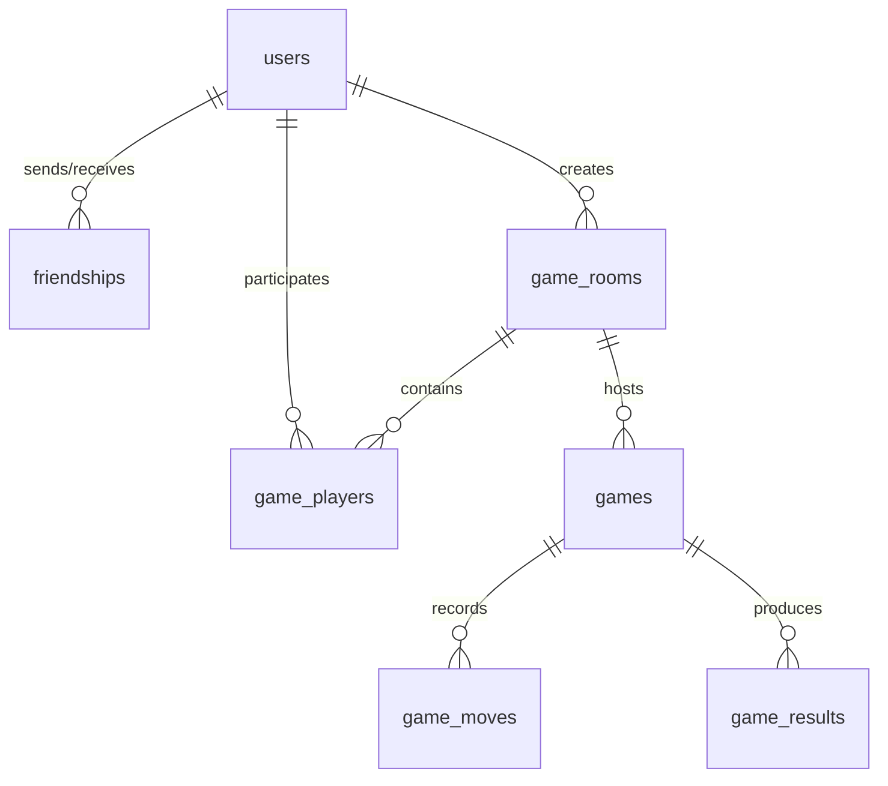
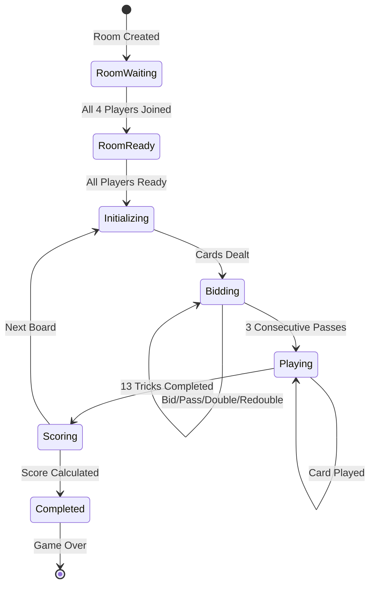
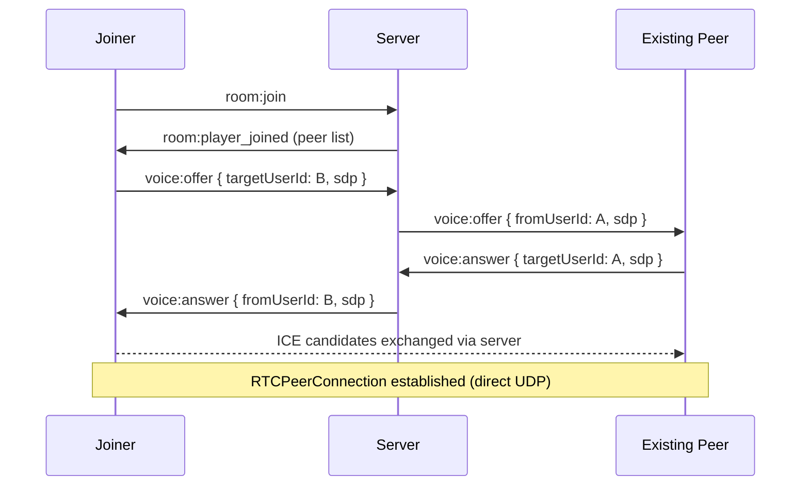

# BridgeOnline — Design Document

## 1. Overview

Web-based real-time multiplayer Contract Bridge (ACBL rules) for 4 players. Built on Next.js 14 App Router with Socket.io for real-time sync and WebRTC for peer-to-peer voice.

### Tech Stack

| Layer | Choice |
|---|---|
| Frontend | Next.js 14 (App Router), Tailwind CSS, Zustand |
| Real-time | Socket.io (game + signaling) |
| Voice | WebRTC (`RTCPeerConnection`) via Socket.io signaling |
| Auth | NextAuth.js v5 |
| Database | PostgreSQL + Prisma ORM |
| Cache | Redis (game state + sessions) |
| Hosting | Hostinger VPS or Vercel + Railway |

---

## 2. Database Schema

### Entity Relationships


```mermaid
erDiagram
    users ||--o{ friendships : "sends/receives"
    users ||--o{ game_players : "participates"
    users ||--o{ game_rooms : "creates"
    game_rooms ||--o{ game_players : "contains"
    game_rooms ||--o{ games : "hosts"
    games ||--o{ game_moves : "records"
    games ||--o{ game_results : "produces"
```

### Tables

**users** — `id`, `email` (unique), `username` (unique), `password_hash`, `avatar_url`, `stats` (JSONB: games_played, games_won, total_score), `created_at`, `last_login`

**friendships** — `id`, `requester_id`, `addressee_id`, `status` (pending/accepted/rejected/blocked), `created_at`

**game_rooms** — `id`, `name`, `invite_code` (unique, 6-10 chars), `creator_id`, `settings` (JSONB: bidding_system, num_boards, timer_enabled, timer_duration), `status` (waiting/ready/in_progress/completed/abandoned), `expires_at` (+24h)

**game_players** — `id`, `game_room_id`, `game_id`, `user_id`, `seat` (north/south/east/west), `is_ready`, `joined_at` — unique constraints on (room, seat) and (room, user)

**games** — `id`, `game_room_id`, `phase` (initializing/bidding/playing/scoring/completed), `game_state` (JSONB), `current_player_id`, `dealer_id`, `declarer_id`, `board_number`, `started_at`, `ended_at`

**game_moves** — `id`, `game_id`, `player_id`, `move_type` (bid/pass/double/redouble/play_card), `move_data` (JSONB), `sequence_number` (unique per game), `created_at`

**game_results** — `id`, `game_id` (unique), `winning_team` (NS/EW), `contract_tricks`, `contract_suit`, `tricks_won`, `score_ns`, `score_ew`, `detailed_scoring` (JSONB)

---

## 3. Game Engine State Machine


```mermaid
stateDiagram-v2
    [*] --> RoomWaiting: Room Created
    RoomWaiting --> RoomReady: All 4 Players Joined
    RoomReady --> Initializing: All Players Ready
    Initializing --> Bidding: Cards Dealt
    Bidding --> Bidding: Bid/Pass/Double/Redouble
    Bidding --> Playing: 3 Consecutive Passes
    Playing --> Playing: Card Played
    Playing --> Scoring: 13 Tricks Completed
    Scoring --> Completed: Score Calculated
    Scoring --> Initializing: Next Board
    Completed --> [*]: Game Over
```

### State Definitions

| State | Entry | Valid Actions | Exit |
|---|---|---|---|
| **RoomWaiting** | Room created | Join, select seat, mark ready, leave | All 4 seats filled |
| **RoomReady** | 4 players joined | Ready/unready, configure settings (creator), leave | All ready |
| **Initializing** | All ready | — (server deals cards, sets dealer + vulnerability) | Auto → Bidding |
| **Bidding** | Cards dealt | Bid (level+suit), Pass, Double, Redouble | 3 consecutive passes |
| **Playing** | Contract established | Play card (must follow suit if possible) | 13 tricks completed |
| **Scoring** | 13 tricks done | — (server calculates score) | More boards → Init; else → Completed |
| **Completed** | All boards done | View scoreboard, exit, new game | — |

### Bidding Rules
- Bid must be higher than previous (suit hierarchy: ♣ < ♦ < ♥ < ♠ < NT)
- Double valid only on opponent's bid; Redouble only on own team's doubled bid
- Declarer = first player from declaring side to bid the contract suit

### Scoring (ACBL Duplicate)
- **Trick score**: Minors (♣♦) = 20/trick, Majors (♥♠) = 30/trick, NT = 40 first + 30 each
- **Doubled/Redoubled**: multiply trick score ×2 / ×4
- **Game bonus**: 300 (not vul) / 500 (vul) when trick score ≥ 100; else 50 partscore
- **Slam bonus**: Small slam 500/750; Grand slam 1000/1500 (not vul / vul)
- **Overtricks**: face value undoubled; 100/200 per trick doubled (not vul/vul)
- **Undertricks**: 50/100 per trick undoubled (not vul/vul); scaled penalties when doubled

---

## 4. API Routes

### Auth
| Method | Route | Description |
|---|---|---|
| POST | `/api/auth/register` | Register — body: `{ email, username, password }` |
| POST | `/api/auth/login` | Login — returns JWT + user profile |

### Users & Friends
| Method | Route | Description |
|---|---|---|
| GET | `/api/users/search?q=` | Search users by username |
| POST | `/api/friends/request` | Send friend request — body: `{ addresseeId }` |
| PATCH | `/api/friends/:id` | Accept/reject — body: `{ action: "accept" \| "reject" }` |
| GET | `/api/friends` | Get friends list + pending requests |

### Rooms
| Method | Route | Description |
|---|---|---|
| POST | `/api/rooms/create` | Create room — body: `{ name, settings }` — returns `{ roomId, inviteCode }` |
| POST | `/api/rooms/join` | Join by invite code — body: `{ inviteCode }` |
| GET | `/api/rooms/:id` | Room details with player list and status |
| PATCH | `/api/rooms/:id/seat` | Select seat — body: `{ seat }` |
| PATCH | `/api/rooms/:id/ready` | Toggle ready — body: `{ isReady }` |

### Game Actions
| Method | Route | Description |
|---|---|---|
| POST | `/api/games/:id/bid` | Make bid — body: `{ action, bid: { level, suit } }` |
| POST | `/api/games/:id/play` | Play card — body: `{ card }` (e.g. `"AS"`) |
| GET | `/api/games/:id/state` | Current game state (hands filtered per player) |

All game actions return `{ success, gameState, error }`. Player hands are server-filtered — each client only receives their own cards.

---

## 5. Real-Time Events (Socket.io)

### Server → Client

| Event | Payload | Trigger |
|---|---|---|
| `room:player_joined` | `{ userId, username, seat }` | Player joins room |
| `room:player_left` | `{ userId, seat }` | Player leaves |
| `room:player_ready` | `{ userId, isReady }` | Ready status changes |
| `game:started` | `{ gameId, dealer, hands }` | Game initializes |
| `game:bid_made` | `{ playerId, bid, nextPlayer }` | Bid placed |
| `game:contract_established` | `{ contract, declarer, dummy }` | Auction ends |
| `game:card_played` | `{ playerId, card, trick }` | Card played |
| `game:trick_completed` | `{ winner, tricksWon }` | Trick resolved |
| `game:dummy_revealed` | `{ dummyHand }` | Opening lead played |
| `game:phase_changed` | `{ phase, gameState }` | Phase transition |
| `game:completed` | `{ results, scores }` | Game ends |
| `timer:tick` | `{ timeRemaining }` | Countdown tick |
| `error` | `{ message, code }` | Error |

### Client → Server

| Event | Payload |
|---|---|
| `room:join` | `{ inviteCode }` |
| `room:select_seat` | `{ seat }` |
| `room:toggle_ready` | `{}` |
| `game:make_bid` | `{ action, bid }` |
| `game:play_card` | `{ card }` |
| `voice:offer` | `{ targetUserId, sdp }` |
| `voice:answer` | `{ targetUserId, sdp }` |
| `voice:ice_candidate` | `{ targetUserId, candidate }` |
| `voice:toggle_mute` | `{ muted }` |

Voice signaling events are mirrored server → client with `fromUserId` replacing `targetUserId`.

---

## 6. Voice Chat (WebRTC)

Voice uses WebRTC P2P audio (sub-50ms latency) with Socket.io as the signaling relay. WebSocket carries only SDP offers/answers and ICE candidates — audio never touches the server unless TURN is needed.

### Architecture

```
         BridgeOnline Server
     Socket.io (signaling relay only)
          │                 │
    Player A ◄─── WebRTC ───► Player B
          │                 │
    Player C ◄─── WebRTC ───► Player D
    [NAT blocked → TURN relay]
```

### Connection Lifecycle


```mermaid
sequenceDiagram
    participant A as Joiner
    participant S as Server
    participant B as Existing Peer
    A->>S: room:join
    S->>A: room:player_joined (peer list)
    A->>S: voice:offer { targetUserId: B, sdp }
    S->>B: voice:offer { fromUserId: A, sdp }
    B->>S: voice:answer { targetUserId: A, sdp }
    S->>A: voice:answer { fromUserId: B, sdp }
    A-->>B: ICE candidates exchanged via server
    Note over A,B: RTCPeerConnection established (direct UDP)
```

### Topology
4 players = full mesh = **6 RTCPeerConnections** (3 per player).

### TURN
Use short-lived HMAC-signed credentials generated server-side per session (see Section 8.6). Options: self-hosted `coturn` or managed Metered.ca / Twilio (~$0.40/GB).

### Voice UI States
| State | Indicator | Behaviour |
|---|---|---|
| Unmuted | Green mic | Streaming to all peers |
| Muted | Red mic | Local mic disabled |
| Disconnected | Yellow warning | Retrying RTCPeerConnection |
| Not joined | Grey mic | Click to enter voice |

### Key Files
- `lib/voice/webrtc-manager.ts` — manages all `RTCPeerConnection` instances
- `lib/hooks/useVoiceChat.ts` — React hook wrapping the manager
- `components/voice/VoiceChatPanel.tsx` — mute/leave controls
- `components/voice/VoiceParticipant.tsx` — speaking indicator per player

---

## 7. UI Components

### Page Structure
- **AuthPages** — Login, Register
- **DashboardPage** — Profile card, Friends list, Create/Join room
- **GameLobbyPage** — Seat selection grid, Settings, VoiceChatPanel, Ready button
- **GameTablePage** — Game header (board info + voice bar), Card table, Bidding panel, Playing panel, Scoring panel

### Key Components

**GameTable** — SVG table layout. North/South/East/West positions. Reveals dummy hand face-up after opening lead. Card deal and trick-collection animations.

**BiddingControls** — 7×5 grid (levels 1–7, suits ♣♦♥♠NT). Pass/Double/Redouble buttons shown conditionally. Invalid bids disabled automatically.

**PlayerHand** — Fan layout, hover to expand, click to play. Highlights valid/invalid cards during play phase. Suits sorted within hand.

**BidHistory** — Table showing auction in seat order (West / North / East / South columns).

### Responsive Breakpoints
- Mobile `< 640px`: vertical table layout, bid grid as modal overlay, swipeable hand
- Tablet `640–1024px`: side-by-side panels
- Desktop `> 1024px`: full table view

---

## 8. Scalability

### 8.1 Redis Socket.io Adapter (P0)
Socket.io defaults to single-process state. Add `@socket.io/redis-adapter` so any server replica can emit to any room.

```javascript
import { createAdapter } from '@socket.io/redis-adapter';
io.adapter(createAdapter(pubClient, subClient));
```

### 8.2 Hot/Cold Game State (P0)
Active game state → **Redis** (fast, 4h TTL). Move log → **PostgreSQL** `game_moves` (permanent). Flush a full snapshot to `games.game_state` only on phase transitions.

### 8.3 BullMQ Action Queue (P1)
Route socket game actions through a BullMQ queue so moves are durable and retriable on server crash.
```
socket event → BullMQ (Redis) → Game Worker → Socket.io broadcast
```

### 8.4 Reconnection Protocol (P1)
On disconnect, set a 30s Redis TTL key (`player:disconnected:{userId}`). If player rejoins within grace period, restore game state from Redis and notify room. After 30s, remove seat.

### 8.5 Service Separation (P2)
Three independently deployable units sharing only Redis and PostgreSQL:
- **Next.js** (stateless, Vercel/VPS)
- **Socket.io server** (signaling + broadcast)
- **Game Worker** (BullMQ consumer)

### 8.6 Dynamic TURN Credentials (P2)
Generate per-session HMAC-SHA1 credentials server-side via `/api/voice/turn-credentials`. Never expose static TURN secrets in the client bundle.

### 8.7 Missing Indexes (P2)
```sql
CREATE INDEX idx_games_room_phase ON games(game_room_id, phase)
  WHERE phase NOT IN ('completed');
CREATE INDEX idx_users_stats_gin ON users USING gin(stats);
CREATE INDEX idx_game_moves_covering ON game_moves(game_id, sequence_number)
  INCLUDE (move_type, move_data);
```

### 8.8 Observability (P3)
- **Sentry** — game engine exceptions + socket errors
- **Pino** — structured logs with `gameId`/`userId` on every line
- **Prometheus + Grafana** — active connections, games/min, queue depth
- **`/api/health`** — DB + Redis connectivity check for uptime monitoring

### Priority Summary
| Priority | Enhancement |
|---|---|
| P0 | Redis Socket.io adapter |
| P0 | Hot/cold game state split |
| P1 | BullMQ action queue |
| P1 | Reconnection protocol |
| P2 | Service separation |
| P2 | Dynamic TURN credentials |
| P2 | Missing DB indexes |
| P3 | Observability stack |

---

## 9. Security

- Passwords hashed with bcrypt (cost 12)
- JWT: 15-min access token, 7-day refresh, HTTP-only secure cookies
- Rate limiting on auth endpoints: 5 attempts / 15 min
- All game moves validated server-side before applying to state
- Player hands never sent to other clients (server filters per-player)
- Invite codes expire after 24 hours

---

## 10. Deployment

### Options
**Option A — Static export + external backend**: Next.js → Hostinger static hosting; Socket.io → separate VPS/server; DB → Supabase/Railway; Redis → Upstash.

**Option B (recommended) — Hostinger VPS**: Next.js + Socket.io + Game Worker all on one VPS behind Nginx reverse proxy, scaling to Option A's split as load grows.

### Environment Variables
```env
DATABASE_URL=postgresql://...
REDIS_URL=redis://...
NEXTAUTH_SECRET=...
NEXTAUTH_URL=https://yourdomain.com
NEXT_PUBLIC_SOCKET_URL=wss://yourdomain.com/socket.io
TURN_SECRET=...          # Server-side only — used to sign TURN credentials
TURN_URL=turn:...
```

### Communication Summary
| Channel | Technology | Purpose |
|---|---|---|
| Game state | Socket.io + Redis adapter | Bids, cards, room events |
| Action processing | BullMQ (Redis) | Durable move queue |
| Voice signaling | Socket.io (same connection) | WebRTC offer/answer/ICE relay |
| Voice audio | WebRTC P2P UDP | Real-time audio |
| Voice fallback | TURN server | NAT traversal |

---

## 11. Future Work

- [ ] Tournament mode (multiple tables)
- [ ] AI opponents for solo practice
- [ ] Game replay with analysis
- [ ] ELO rating system
- [ ] Mobile apps (React Native)
- [ ] Spectator mode
- [ ] Teaching mode with hints
